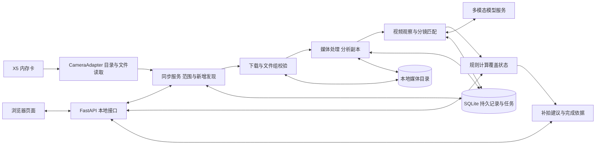

# 架构与模块接口设计 v1.0

> 设计基线，尚未实现。配套入口：[开发计划](../开发计划_初稿.md)、[测试流程](开发测试与验收流程.md)。本文件中的类名、字段和 API 是本项目契约，不是未经验证的影石 SDK 接口。

## 1. 运行架构

采用模块化单体：一个本地后端进程，内部运行持久队列 worker 和目录扫描器；一个浏览器前端。无需 Redis、微服务或多个自主 Agent。模型访问是后端发起的外部网络调用，原片默认保存在 Mac。



API、设备扫描、下载、模型任务通过异步 I/O 或受控子进程运行，不能把耗时转码放在 API 请求中阻塞。首版每设备一个命令通道、一个下载任务，每项目一个状态提交通道，模型并发默认 1；性能实测后再调整。

本地服务默认只监听 `127.0.0.1`，前端与后端在发布运行方式下同源。开发环境只允许指定前端源；写接口检查来源，不允许任意网页控制本地服务。模型密钥只在后端。相机数据读取限定已配置设备，下载响应不得重定向到非设备目标，文件路径使用内部 ID 生成。

## 2. 模块责任与内部接口

类型均应在 `contracts/` 或后端共享 schema 中定义，禁止模块各写一份不一致的字典。下表是函数语义，不限制最终类组织方式。

| 模块/目录 | 功能边界 | 输入 → 输出 |
|---|---|---|
| ProjectService `projects/` | 项目、分镜编辑和锁定 | `create(goal, target_seconds, conditions) → Project`；`confirm_plan(project_id, expected_revision) → Plan` |
| PlanningService `analysis/planning` | 目标拆解，输出可检查标准 | `generate_plan(goal, conditions) → ShotDraft[]` |
| CameraAdapter `camera/` | 屏蔽真实协议，不归属项目，不做 AI | `connect(config) → DeviceCapabilities`；`list_media(cursor?) → CatalogPage`；`inspect(remote_id) → RemoteAsset`；`download(remote_id, revision, temp_path) → TransferResult` |
| SyncService `sync/` | 全量扫描、目录基线、范围、增量与重连 | `scan(device_id) → ScanJob`；`confirm_scope(project_id, snapshot_id, selected_group_ids) → SyncSession`；`reconcile(session_id) → DiscoveryResult` |
| ImportService `media/import` | 下载组、就绪校验、去重、导入任务 | `enqueue_group(project_id, group_revision) → ImportJob`；`finalize_download(job_id) → Clip` |
| MediaService `media/` | 元数据、格式/投影检查、可播放副本 | `probe(paths) → MediaInfo`；`prepare(clip_id, profile) → Rendition[]` |
| AnalysisService `analysis/` | 调用模型、结构校验、观察与候选证据 | `observe(rendition_id, analysis_profile) → Observation[]`；`match(observations, plan) → CandidateEvidence[]` |
| CoverageService `coverage/` | 纯规则判定，不调用模型 | `evaluate(plan, active_evidence) → CoverageResult` |
| RecommendationService `coverage/advice` | 优先缺口、可执行单条建议 | `next_action(coverage, conditions) → NextAction`；模型润色不能改缺口和 ID |
| SnapshotService `api/snapshot` | 读取一致版本，组合页面数据 | `snapshot(project_id) → ProjectSnapshot` |
| JobService `jobs/` | 持久队列、重试、租约、过期结果隔离 | `enqueue(key, kind, payload) → Job`；`claim/complete/fail/retry` |
| Repository `storage/` | 事务和唯一约束 | 其他模块经仓储写库，不直接随意修改跨模块表 |
| 前端 `frontend/` | 用户操作、状态显示、播放与证据跳转 | 只调用 HTTP API，不调用模型或相机，不重算业务结论 |

CameraAdapter 能力返回必须包含 `history_video_listing`、`listing_during_recording`、`download_during_recording`、`group_metadata`、`readiness_signal`，值为 `supported/unsupported/unknown`，附版本和验证依据。未知能力不得自动当作支持。

没有可靠变化事件时采用轮询；不存在已验证通知接口时不构造 WebSocket/push 能力。`list_media` 的本项目抽象不代表官方 OSC 已验证支持视频及分页，真实参数由 T00 确定。

## 3. 数据模型与标识

所有内部 ID 使用不可变唯一值；时间存 UTC，界面按本地显示。相机拍摄时间作为展示与辅助信息，不能作为唯一增量游标。项目修订号 `revision` 是单调递增整数。

| 实体 | 核心字段与约束 |
|---|---|
| Project | id、goal、target_seconds、conditions、plan_version、revision、created_at |
| Shot | id、project_id、plan_version、order、title、required、criteria[]；确认清单不能为空 |
| Criterion | id、shot_id、描述、必要性、是否要求连续动作/同一时间段；不能用几个互不相干的静帧证明连续操作 |
| Device | id、型号、固件、capabilities、connection_state、verified_at；敏感标识不出现在普通日志 |
| CatalogSnapshot | id、device_id、session_epoch、started_at、completed_at、complete、目录条目集；失败扫描不能标 complete |
| RemoteAsset | device_id、storage_epoch、remote_id/path、远端大小/修改标记、first_seen、remote_revision；卡变化无法判定时需用户重新确认存储会话 |
| CaptureGroup | id、成员 RemoteAsset 修订列表、完整性依据、readiness、group_revision；一组可能对应多个镜头文件或时间分段 |
| SyncSession | id、project_id、device_id、状态、baseline_snapshot_id、membership_epoch、last_complete_scan_at；同设备仅一个活动会话 |
| Membership | session_id、group_id、group_revision、included/excluded/pending_confirmation、原因；未选历史条目永久保留排除记录直到用户显式改选 |
| Clip | id、project_id、source_group_revision、来源、状态、内容哈希、active；一次录制逻辑上只生成一个 Clip |
| Rendition | id、clip_id、原片修订、处理配置版本、文件路径、hash、duration、投影/视角、分段及原片时间映射 |
| Job | id、kind、key、payload、状态、attempt、lease_until、error、next_attempt_at、输入版本；key 有唯一约束 |
| Observation | id、rendition_id、time_range、可见动作、质量问题、uncertainties、模型及提示词版本 |
| Evidence | id、shot_id、criterion_id、observation_id、rendition_id、start/end、supports/defect/uncertain、reason、输入版本、active |
| CoverageResult | project_revision、各分镜状态/标准覆盖、未满足原因、evidence_ids |
| NextAction | id、project_revision、shot_id、拍什么/怎么拍/为什么、依据 IDs；生成延迟时禁止展示过期建议 |

素材归属、任务入队和项目修订号更新在同一事务完成。模型结果入库、证据激活、覆盖重算也在事务中提交；耗时模型/转码在事务外执行，提交前核对输入版本。

## 4. 自动同步算法

### 4.1 首次基线与范围确认

1. 拉取所有页面，处理重复条目，记录扫描开始/结束与是否完整。分页变动可能导致漏条目，采用复扫对账或适配器提供的稳定快照保证；不以第一页作为完整卡目录。
2. 前端显示 snapshot_id，用户勾选文件组；其余已有组记录为 excluded，而不是留作未来新增。
3. 确认范围时再扫描一次。两次之间出现的新组单独展示为 pending_confirmation，防止用户选择期间新增素材被误分项目。
4. 冻结新基线并开始 watching；确认后首次发现的组自动加入当前活动项目。现场切换拍摄主题应暂停同步或新建项目；误收可从项目排除。
5. 初次扫描失败、存储卡变化、完整枚举能力不可用时，不允许盲目建立自动同步基线。

### 4.2 新增检测与就绪

建议初始目录轮询间隔 5 秒，失败按 5/10/20/40/60 秒退避，成功恢复正常；这是可调设计值，不是已测性能。`/osc/info` 等接口遵循官方限频，各设备命令串行。[OSC 概述](https://insta360develop.github.io/Insta360-Developer_Docs/ch/x/osc/guide/)

就绪需同时考虑：录制/文件关闭信号（如有）、预期组成员、跨扫描稳定元数据，以及完整下载后的媒体校验。没有关闭信号时，稳定大小仅为候选线索，必须在 T00 实测其可靠性；至少两次间隔扫描稳定并不保证完成。无法确定组完整或拍摄终止时保留 awaiting_ready，不能抢先分析。

下载到 `.part` 临时路径，核对传输字节数、组成员及前后远端修订，成功后原子移动到正式目录。处理读取/解码校验失败时保留失败记录；不得只因文件可打开就判定完整。

### 4.3 去重与变更

- 远端键：设备 + 存储会话 + 远端 ID；内容版本包含可信元数据与组成员版本。不能只按文件名或时间戳去重。
- 本地完整下载后对内容计算 hash；同项目相同有效内容与分析配置复用结果。
- 作业键包含项目、文件组修订、媒体配置、模型/提示词及清单版本；仅更改镜头排序不触发视频重新观察。
- 同名但新内容需作为新修订；当远端无法提供可信修订时，适配器采用复核下载/hash，重连或疑似换卡时重新确认，不能假设同名即同内容。
- 素材源变更时旧任务结果不得成为当前证据；本地留存的旧版本可保留历史，但新修订须重新处理。明确排除项目素材会停用其证据并重算覆盖。
- 远端文件被删除，不删除已验证的本地副本及证据；若本地证据文件丢失则将对应证据标失效，不再计入覆盖。

### 4.4 暂停、断连与恢复

暂停停止新增入队，已入队任务可继续。重启/断连恢复后先核验设备身份及存储会话，再做完整补扫；基线外新增条目进入待确认，避免把离线期间其他项目素材自动加入。确认后更新基线并恢复 watching。失败扫描不推进游标，不把相机暂时失联解释为整卡文件已删除。

缺外网时保留下载与分析任务，标 waiting_network。若同一 Mac 无法同时连接相机网络和外网，应在使用说明中写明切换步骤；只有联网切换可操作且不漏片，才允许按该受限模式验收，并披露不能持续同时同步分析。

## 5. 状态流与完成判断

### 三类状态不能混用

- 同步：`idle → scanning → awaiting_scope → watching`；分支 `paused/disconnected/error`；重连先 `awaiting_scope`。
- 素材处理：`discovered → awaiting_ready → downloading → preparing → queued → analyzing → analyzed`；分支 `waiting_network/blocked_format/failed/excluded`。
- 分镜：`pending（待拍）/covered（已完成）/reshoot（需补拍）/uncertain（待确认）`。

Job 另使用 `queued/running/retry_wait/succeeded/failed/cancelled`，与用户素材进度分开；每次尝试持有租约和 attempt ID。过期租约重入队前核验已有文件/结果。相同输入的外部调用崩溃后可能重复付费：优先使用供应商幂等能力（如有），否则记录重复尝试风险，不承诺外部调用 exactly-once。

### 分镜计算

逐 criterion 检查有效支持证据，全部必要 criterion 满足才算 covered。需要连续操作的 criterion 必须由满足连续约束的时间段支持；多个片段可以满足不同 criterion。无候选为 pending；未满足且有明确缺陷为 reshoot；其余有相关但不确定证据为 uncertain。已有充分好证据优先于新坏片。

证据必须属于当前项目、有效素材版本和清单，满足 `0 <= start < end <= rendition.duration`。模型只能提供候选证据；结构校验并不证明视觉判断真实，视觉正确性由冻结样例及真机评估验证。

推荐优先级：阻塞必要关键步骤的缺口 → 其他必要缺口 → 可选改进；相同优先级按清单顺序。下一建议只指向当前未完成项，含拍什么、怎么拍、为什么。模型超时时使用规则模板，不因此丢失已计算覆盖。

### coverage_complete 与 readiness 必须分离

`coverage_complete`：确认后的非空必要清单已被当前有效证据完整覆盖。

`readiness`：

- `not_ready`：有必要缺口。
- `checking`：覆盖齐全，但还有范围待确认、未就绪/下载/处理任务，或尚需扫描对账。
- `unverified`：覆盖齐全，但相机断连/同步暂停/扫描过期，无法核验最新素材。
- `ready`：覆盖齐全；当前已纳入素材均分析完成或被用户明确排除；无待确认范围和关键不确定项；在最新处理完成后至少有一次完整扫描无新增未处理项，且未检测到仍在录制（若该状态可用）。

`ready` 只针对 `verified_snapshot_id + checked_at`，不保证相机未来不会拍出新素材。扫描新发现条目时立即回到 checking，保留 coverage_complete。默认扫描有效期建议 15 秒，超过后显示最新状态未核验；参数通过真机调优。硬件无录制状态时必须写明「截至本次扫描已可见素材」，不能声称检测到所有尚未落盘片段。

分析失败不会倒扣已有分镜覆盖，但已纳入项目的未解决失败阻止 ready；用户可重试或排除该素材。排除不产生新证据。

## 6. HTTP API 契约

前缀 `/api/v1`，ID 均为内部 ID。所有写入返回最新 revision；用户修改携带 `expected_revision`，过期返回 409。所有创建/入队请求接受 `Idempotency-Key`，重复请求返回相同资源。同键不同请求体返回 409。普通读取分页使用不透明 cursor。

| 方法与路径 | 请求 | 成功响应/语义 |
|---|---|---|
| POST `/projects` | goal、target_seconds、conditions | 201 Project |
| GET `/projects` | cursor、limit | 200 项目页 |
| POST `/projects/{p}/plan:generate` | expected_revision | 202 job_id；失败不覆盖原草稿 |
| PATCH `/projects/{p}/plan` | 完整 shots、expected_revision | 200 草稿；已确认拒绝修改 |
| POST `/projects/{p}/plan:confirm` | expected_revision | 200 plan_version；必要项非空 |
| POST `/devices:connect` | 已配置连接 profile_id | 202 job_id；不接受任意目标 URL |
| GET `/devices/{d}` | 无 | 200 连接状态与能力 |
| POST `/devices/{d}/scans` | 无 | 202 scan_job_id |
| GET `/devices/{d}/catalog` | snapshot_id、cursor、limit | 200 文件组页、complete、next_cursor；只返回指定快照 |
| POST `/projects/{p}/sync-sessions` | device_id、snapshot_id、selected_group_ids、expected_revision | 201 会话；发生范围竞争时返回 awaiting_scope 或 409，不自动扩大范围 |
| POST `/sync-sessions/{s}/scope:confirm` | snapshot_id、include_group_ids、exclude_group_ids、expected_revision | 200 重新确认范围；覆盖所有待确认条目 |
| POST `/sync-sessions/{s}/pause` | expected_revision | 200 paused；不取消已下载素材分析 |
| POST `/sync-sessions/{s}/resume` | expected_revision | 202 补扫任务；并非直接 watching |
| POST `/sync-sessions/{s}/close` | expected_revision | 200 结束当前会话，释放设备归属 |
| POST `/projects/{p}/imports` | multipart 文件、expected_revision | 202 导入 job_id；备用入口 |
| GET `/projects/{p}/snapshot` | 可选 after_revision | 200 一致快照；无更新可返回 304 |
| GET `/projects/{p}/clips` | cursor、limit | 200 素材页 |
| GET `/clips/{c}` | 无 | 200 素材、证据与处理状态 |
| GET `/renditions/{r}/content` | HTTP Range | 200/206 视频内容，不能传任意路径 |
| PATCH `/projects/{p}/clips/{c}/membership` | included/excluded、reason、expected_revision | 200 重算后的 revision；重新包含需校验可用版本 |
| GET `/jobs/{j}` | 无 | 200 状态、进度、错误及恢复操作 |
| POST `/jobs/{j}/retry` | expected_attempt | 202 job_id/attempt；运行中返回 409 |
| GET `/health` | 无 | 200 服务、worker、数据库与配置状态；不包含密钥 |

无相机开始/停止录制、删除相机文件、强制判定拍够的 API。连接和扫描失败均通过 job 或设备状态返回，不能以 HTTP 200 空列表冒充成功扫描。

统一错误示例：

```json
{
  "error": {
    "code": "DEVICE_DISCONNECTED",
    "message": "相机已断开，已下载素材仍保留",
    "retryable": true,
    "action": "reconnect",
    "job_id": "job_12"
  },
  "request_id": "req_12"
}
```

错误码至少覆盖：`DEVICE_DISCONNECTED`、`CAPABILITY_UNVERIFIED`、`CATALOG_INCOMPLETE`、`SCOPE_STALE`、`GROUP_NOT_READY`、`DOWNLOAD_INCOMPLETE`、`MEDIA_UNSUPPORTED`、`STORAGE_FULL`、`NETWORK_UNAVAILABLE`、`MODEL_TIMEOUT`、`MODEL_OUTPUT_INVALID`、`STALE_REVISION`。文件/模型原始异常存本地脱敏日志，页面显示可执行的恢复动作。

一致快照结构示例（字段示意，T01 生成完整 Schema）：

```json
{
  "project_id": "p1",
  "revision": 18,
  "plan_version": 1,
  "sync": {
    "state": "watching",
    "last_complete_scan_at": "2026-09-22T08:00:00Z",
    "pending_scope_count": 0
  },
  "pipeline": {"waiting": 0, "running": 1, "failed": 0},
  "shots": [{"id": "s1", "state": "covered", "evidence_ids": ["e1"]}],
  "coverage_complete": false,
  "readiness": "not_ready",
  "checked_at": null,
  "verified_snapshot_id": null,
  "next_action": {
    "project_revision": 18,
    "shot_id": "s2",
    "what": "补拍连接主体的动作",
    "how": "从侧上方拍摄，保持连接处可见",
    "why": "现有片段中连接处被手遮挡"
  }
}
```

前端忽略小于已展示 revision 的快照；相同 revision 可刷新时间驱动的 freshness/readiness，或后端在 freshness 变化时递增 revision，两者必须在 T01 统一选择。推荐后者，304 仅在包括 freshness 的快照未变化时返回。

## 7. 日志、配置和资源边界

日志串联 `request_id/project_id/session_id/group_id/clip_id/job_id/attempt`；记录扫描数量、差异、等待原因、下载/媒体/模型耗时、结果版本和错误码。日志不记录密钥、相机 Wi-Fi 密码及完整敏感地址。

配置集中在明确顶部配置/环境变量：设备 profile、扫描/退避时间、稳定检查策略、源文件和磁盘配额、分析分段长度/分辨率、模型 timeout、有限重试次数、模型并发、任务租约。源文件不应继承旧计划 100 MB 的上传上限；T00/T05 根据实测写出有单位的最终值。

建议正式运行文件结构：`data/app.sqlite`、`data/originals/{clip_id}/`、`data/renditions/{id}/`、`data/tmp/`、`data/logs/`。数据库和媒体目录不提交 Git。清理暂存文件不能删除还被任务引用的文件；用户删除本地项目需先结束同步，不能连带删除相机文件。

## 8. 开发目录建议

```text
frontend/src/{pages,components,api,types}/
backend/app/{api,projects,camera,sync,media,analysis,coverage,jobs,storage}/
contracts/{openapi.json,schemas}/
tests/{unit,integration,e2e,fixtures,live}/
tools/probes/
scripts/
docs/
```

Python Schema 为 HTTP 类型来源，生成 OpenAPI 和前端类型；领域 fixtures 由前后端共用。真实 Camera/Model adapter 可替换为契约相同的假实现；模拟标识进入 health 和快照供界面明确显示，正式验收必须报告两者为 real。
